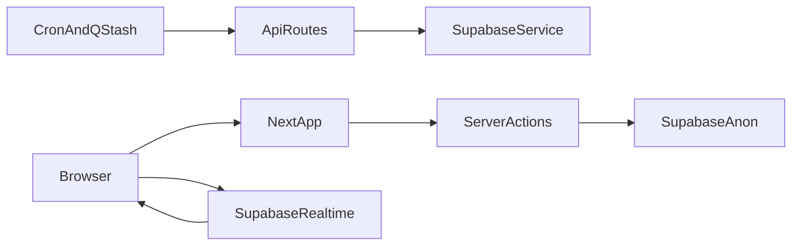

# Arquitetura

O **NGE Calendar** é uma aplicação **Next.js 16** (App Router) com **React 19**, **Tailwind CSS 4** e **Supabase** (PostgreSQL + Auth + Realtime).

## Fluxo geral

- **Páginas e layouts** em `app/`: login em `/`, área autenticada com sidebar em `app/(app)/`.
- **Server Actions** em `app/actions/`: eventos, clientes, usuários e autenticação; usam o cliente Supabase com cookies (`@supabase/ssr`).
- **Middleware** (`middleware.ts`): renova sessão e protege rotas (visitantes só em `/`).
- **API routes**: webhook QStash (`/api/webhooks/event-reminder`) e cron opcional (`/api/cron/reminders`) usando **service role** onde necessário.
- **Agenda**: Client Component com **Schedule-X** (`useNextCalendarApp`), atualização em tempo real via **Supabase Realtime** na tabela `events`.

## Variáveis de ambiente

Ver [`.env.example`](../.env.example). Nunca expor `SUPABASE_SERVICE_ROLE_KEY` ou tokens QStash no cliente.
